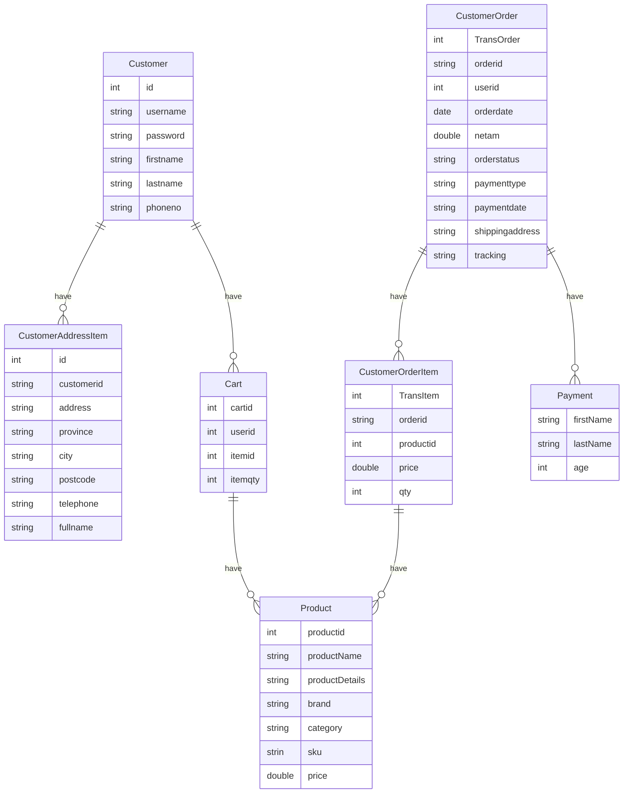

```mermaid
erDiagram
   Customer ||--o{ CustomerAddressItem  : have  
    Customer {
        int id
        string username
        string password
        string firstname
        string lastname
        string phoneno
    }
    
    CustomerAddressItem {
        int id
        string customerid
        string address
        string province
        string city
        string postcode
        string telephone
        string fullname
    }
    Customer ||--o{ Cart : have 
    
    Cart {
        int cartid
        int userid
        int itemid
        int itemqty 
    }
    Cart ||--o{ Product : have
    Product {
        int productid
        string productName
        string productDetails
        string brand
        string category
        strin sku
        double price
    } 
    
    CustomerOrder {
        int TransOrder
        string orderid
        int userid
        date orderdate
        double netam
        string orderstatus
        string paymenttype
        string paymentdate
        string shippingaddress
        string tracking
    }
     
    CustomerOrder ||--o{ CustomerOrderItem : have 
    CustomerOrderItem {
        int TransItem
        string orderid
        int productid
        double price
        int qty
    }
    CustomerOrderItem ||--o{ Product : have
    CustomerOrder ||--o{ Payment : have 
    Payment {
        string firstName
        string lastName
        int age
    }
    
```
