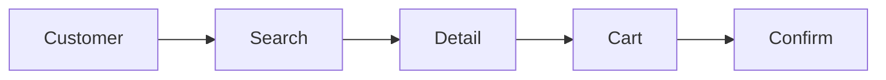

#### assignment-java-boot-camp week-1 

# E-Commerce 

#### Flow System

> https://github.com/angkhanalil/assignment-java-boot-camp/wiki/Flow-System

#### Swagger Document
> http://localhost:8080/swagger-ui/index.html?configUrl=/v3/api-docs/swagger-config

